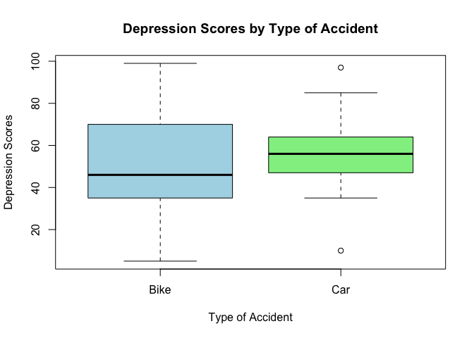

Homework1
================
Kangyu Xu (kx2224)
2024-09-20

## Question1

1)  Qualitative: Ordinal
2)  Qualitative: Binary
3)  Qualitative: Nominal
4)  Quatitative: Continuous
5)  Quatitative: Discrete

## Question2

``` r
# Basic info
bike_scores <- c(45, 39, 25, 47, 49, 5, 70, 99, 74, 37, 99, 35, 8, 59)
car_scores <- c(67, 50, 85, 43, 64, 35, 47, 97, 58, 58, 10, 56, 50)
```

### a) Compute Mean, Median, Range, SD

``` r
mean_bike = mean(bike_scores)
median_bike = median(bike_scores)
range_bike = range(bike_scores)
sd_bike = sd(bike_scores)
cat("Mean (bike crash group):", mean_bike, "\n")
```

    ## Mean (bike crash group): 49.35714

``` r
cat("Median (bike crash group):", median_bike, "\n")
```

    ## Median (bike crash group): 46

``` r
cat("Range (bike crash group):", range_bike, "\n")
```

    ## Range (bike crash group): 5 99

``` r
cat("Standard Deviation (bike crash group):", sd_bike, "\n")
```

    ## Standard Deviation (bike crash group): 28.84603

### b) Plot

``` r
# Box plot
accident_type <- factor(c(rep("Bike", length(bike_scores)), rep("Car", length(car_scores))))
depression_scores <- c(bike_scores, car_scores)

boxplot(depression_scores ~ accident_type, 
        main = "Depression Scores by Type of Accident",
        xlab = "Type of Accident",
        ylab = "Depression Scores",
        col = c("lightblue", "lightgreen"))
```

<!-- -->

### c) description

## Question3

### a)

$$ 
P(\mathrm{even\ number}) = \frac{1}{2}
$$
